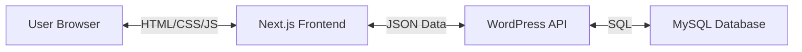

# The Rooms Poundbury - Technical Documentation

## 1. Architecture Overview

This project utilizes a **Headless WordPress Architecture**, decoupling the content management system (backend) from the user interface (frontend).

*   **Backend**: WordPress (running in Docker). Acts solely as a headless CMS and API provider.
*   **Frontend**: Next.js 14 (App Router). Consumes data from WordPress via REST API and renders it as a high-performance React application.
*   **Communication**: JSON via HTTP REST API.

### Diagram


## 2. Technology Stack

### Frontend
*   **Framework**: Next.js 14 (App Router, Server Components)
*   **Language**: TypeScript
*   **Styling**: Tailwind CSS (Utility-first)
*   **Animations**: Framer Motion (Complex animations), CSS Transitions
*   **State Management**: React Server Components (Server state), React Hooks (Client state)
*   **Icons**: Heroicons / React Icons

### Backend
*   **CMS**: WordPress 6.x
*   **Server**: Apache/PHP (via Docker)
*   **Database**: MySQL 5.7/8.0
*   **Custom Plugin**: `the-rooms-architecture` (Handles CPTs and API fields)

## 3. Key Components & Features

### 3.1 Design System (`globals.css` & `tailwind.config.js`)
*   **Colors**: A premium palette based on deep greys (`brand-800`, `brand-900`) and soft warm greys (`brand-50`, `brand-100`).
*   **Typography**: `Playfair Display` for headings (Serif, Premium) and `Inter` for body (Sans, Clean).
*   **Glassmorphism**: Extensive use of `backdrop-blur` and semi-transparent whites to create depth.

### 3.2 Custom Components
*   **`TiltCard.tsx`**: A 3D-interactive card that tracks mouse movement to tilt and show a glare effect. Uses `framer-motion`'s `useMotionValue` and `useTransform` for 60fps performance.
*   **`AnimatedSection.tsx`**: A wrapper that triggers a fade-in/slide-up animation when the content enters the viewport.
*   **`ClientHome.tsx`**: The main landing page component, separated as a Client Component to handle rich interactivity.

## 4. Data Fetching & Caching

Data fetching is centralized in `src/lib/wordpress.ts`.

*   **Method**: `fetch()` API with Next.js extensions.
*   **Caching Strategy**: **Incremental Static Regeneration (ISR)**.
    *   `revalidate: 60`: Pages are generated statically at build time. When a request comes in, if the cache is older than 60 seconds, Next.js triggers a background re-fetch to update the static file.
    *   **Benefit**: Users get instant static HTML (speed), but content updates appear within a minute (freshness).

```typescript
// Example Fetch
export async function getPages() {
    const response = await fetch(`${API_URL}/wp-json/wp/v2/pages`, {
        next: { revalidate: 60 }, // ISR Magic
    });
    return response.json();
}
```

## 5. Custom Post Types (CPT)

The backend structure is defined in the WordPress plugin `the-rooms-architecture.php`.

| Post Type | Endpoint | Description |
| :--- | :--- | :--- |
| **Services** | `/wp-json/wp/v2/service` | Therapy types (e.g., "Physiotherapy") |
| **Team** | `/wp-json/wp/v2/team` | Therapist profiles |
| **Case Studies** | `/wp-json/wp/v2/case_study` | Success stories |

## 6. Deployment Guide

### Frontend (Vercel/Netlify)
1.  Connect GitHub repository.
2.  Set Environment Variables:
    *   `NEXT_PUBLIC_WORDPRESS_URL`: The public URL of your WordPress site.
3.  Deploy. Next.js will build the static pages.

### Backend (Hosting Provider)
1.  Install WordPress on any standard host (SiteGround, WP Engine, DigitalOcean).
2.  Install & Activate the `the-rooms-architecture` plugin.
3.  Ensure Permalinks are set to "Post Name".
4.  **Security**: Restrict access to `/wp-admin` but ensure `/wp-json` is publicly accessible (or protected via API key if needed).

## 7. Future Development

*   **Search**: Implement a global search bar using the `/wp-json/wp/v2/search` endpoint.
*   **Forms**: Connect the Contact Form to a server action or third-party service (e.g., Formspree) as WP mail can be unreliable in headless setups.
*   **SEO**: Implement `next-sitemap` for automatic sitemap generation.
